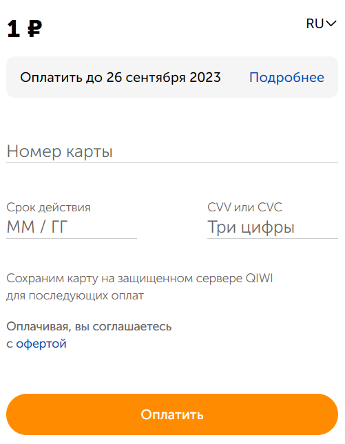
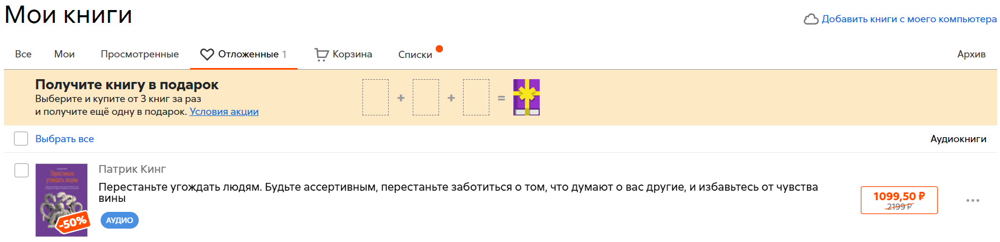
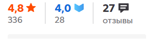
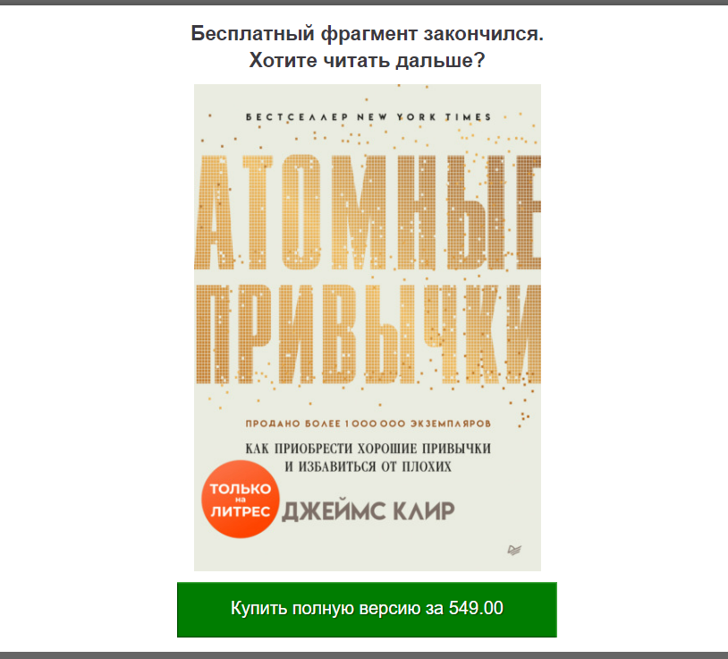
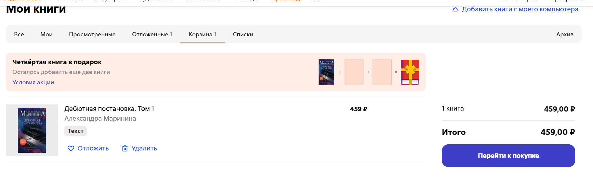
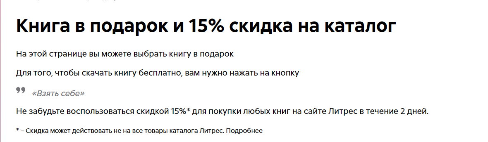

# Lab_04 Test Cases
## https://www.litres.ru/audioknigi/

**AAA_04_1** Проверка работы акции для новых пользователей.  
**Краткое описание:** при создании нового аккаунта, для увеличения заинтересованности пользователя предложить ему тестовую подписку на месяц за 1 рубль.  
**(предусловие) Входные данные:** для осуществления кейса нам необходимо создать новый аккаунт, на котором ни разу не осуществлялась платная подписка на сервис. а также будем использовать входные данные: *реквизиты карты с целью перевода 1 рубля, чтобы система могла запомнить реквизиты.*

**Шаги:**
    1. с главной страницы перейти на страницу с акцией.  
    2. ввести реквизиты карты  
    3. нажать оплатить.  

**Ожидаемый результат** после заполения реквизитов карты и успешного перевода, подписка будет добавлена на аккаунт.  
  
**Фактический результат** подарочный купон успешно отображается для нового пользователя.  
**Статус** пройден успешно.

---

**AAA_04_2** Проверка добавления книги в избранное.  
**Кратное описание:** проверка работы функции избранное, для книг которые мы не планируем приобретать, но хотим отложить в особый каталог для хранения.  
**(предусловие) Входные данные:** перейти в каталог, далее выбрать понравившуюся аудиокнигу, нажать на ее профилль. входные данные: *книга не должна быть приобретена\добавлена в избранное\в корзину.*

**Шаги:**  
    1. нажать на кнопку отложить  
    2. перейти в отложенные.

**Ожидаемый результат** книга будет отображена в разделе понравившиеся для удобного перехода на ее главную страницу  
  
**Фактический результат** книга отображена в отоложенных  
**Статус:** пройден успешно.

---

**AAA_04_3** Проверка возможности добавления отзыва без авторизации.  
**Кратное описание:** во избежания спама и неверефицированных отзывов необходимо исключить возможность их написания.  
**(предусловие) Входные данные:** необходимо не быть авторизованным в аккаунте.

**Шаги:**  
    1. нажать на любую книгу в каталоге  
    2. нажать на отзывы.  
    3. нажать на поле с отзывом и начать заполнение.

**Ожидаемый результат** отзыв не будет добавлен.  
  
**Фактический результат** невозможно зайти в отзывы 
**Статус:** пройден успешно.

---

**AAA_04_4** Проверка предпросмотра книги  
**Кратное описание:** перед преобретением книги на сайте у пользователя должна быть возомжность предпросмотра, для тех кому интересно ознакомится с первыми главами.    
**(предусловие) Входные данные:** необходимо быть авторизованным в аккаунте.

**Шаги:**  
    1. нажать на предпросмотр  
    2. нажать долистать до конца отрывка.

**Ожидаемый результат** можно ознакомится с 1-2 главами и получить предложение добавить книгу в корзину  
  
**Фактический результат** 2 главы доступны к прочтению, а после перехода с последней доступной страницы на следующую, появляется предложение о покупке  
**Статус:** пройден успешно.

---

**AAA_04_5** Проверка работы алгоритмов предложения к чтению.  
**Кратное описание:** список предлогаемых книг должен содержать книги на основе предпочтений пользователя.    
**(предусловие) Входные данные:** необходимо быть авторизованным в аккаунте и предварительно просмотреть минимум 10 книг в каталоге(перейти на их страницы).

**Шаги:**  
    1. нажать на раздел "что почитать?"  
    2. ознакомится со списком.

**Ожидаемый результат** список предлогаемых к прочитению произвдений будет состоять из пары уже открытых книг, книг смежных жанров и пары рандомных популярных книг.  
  
**Фактический результат** содержимое списка соответствует ожиданиям.  
**Статус:** пройден успешно.

---

**AAA_04_6** Проверка добавления в корзину   
**Кратное описание:** в авторизованном аккаунте по нажатию на кнопку добавить в корзину она будет добавлятся.  
**(предусловие) Входные данные:** необходимо быть авторизованным в аккаунте

**Шаги:**  
    1. нажать на книгу в каталоге  
    2. нажать на кнопку с иконкой корзины  
    3. перейти в корзину и проверить наличие.

**Ожидаемый результат** добавленая книга будет доступна к покупке в разделе корзины.  
  
**Фактический результат** что и ожидалось  
**Статус:** пройден успешно.

---

**AAA_04_7** Проверка работы промокодов   
**Кратное описание:** в авторизованном аккаунте попробовать ввести промокод.  
**(предусловие) Входные данные:** необходимо быть авторизованным в аккаунте. входные данные: *промокод с тематического сайта*.

**Шаги:**  
    1. нажать на раздел промокод  
    2. ввести в поле имеющийся код. 
    3. выбрать предлогаемые подарки и бонусы  
    4. подтвердить.

**Ожидаемый результат** будут получены бонусы (в примере книга и 15% скидка на след. покупку)  
  
**Фактический результат** что и ожидалось  
**Статус:** пройден успешно.

---

**AAA_04_8** Проверка подписки на подкаст.   
**Кратное описание:** подписаться на определенный подкаст.  
**(предусловие) Входные данные:** быть авторизованным в аккаунте

**Шаги:**  
    1. нажать на раздел подкасты  
    2. выбрать подкаст и перейти на его страницу. 
    3. нажать подписаться на уведомления.  

**Ожидаемый результат** подкаст появится в профиле  
  
**Фактический результат** подкаст не появился в списке подкастов  
**Статус:** не пройден.